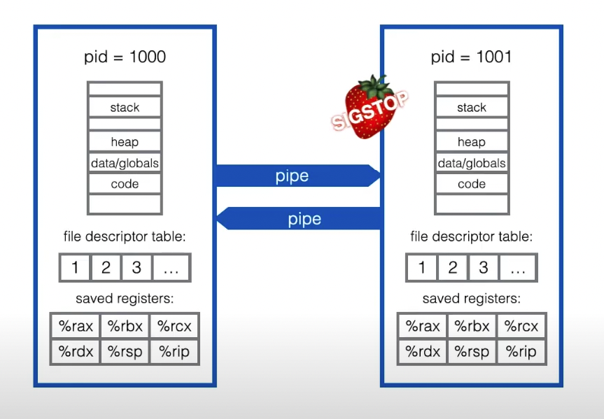
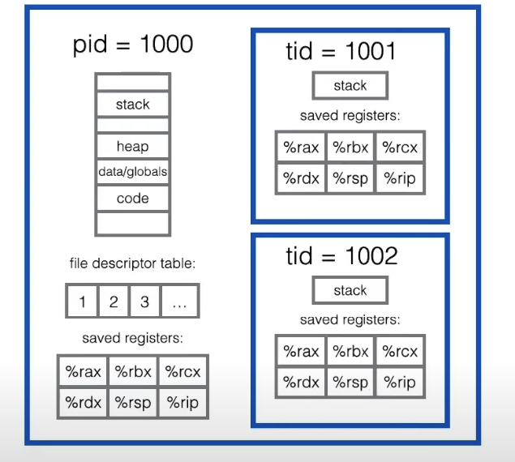
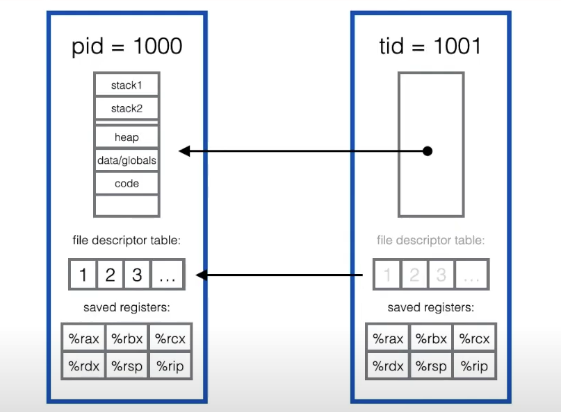

# Lecture 7,8 Multiprocessing

## 并发

- [C Multiprocessing](https://codehs.com/tutorial/neel/Introduction_to_Multiprocessing_in_C-1)

- fork()

如果新的进程需要执行新的函数（修改堆内存），最好的方式是开一个新的可执行文件，再同时运行

为什么需要fork之后再syscall(execvp)，而不是直接调用

如果只用syscall，需要做非常多的确认，非常麻烦

但是分开处理就会变得很自由，而且简洁(Simple != Easy)


## `Command`

`Command::new("ps").args(&["--pid", &pid.to_string(), "-o", "pid= ppid= command"])`

- run the process

  - `.output()`: running the process, waiting it to finish and getting the output
  - `.status()`: running the process, waiting it to finish but not getting the output(goes to terminal or parent process)
  - `.spawn()`: spawn and immediately return a `Child`, which can be waited in the future `let status = child.wait`

  - `pre_exec()`: **UNSAFE**, should not allocate memory or access shared data!

  


## I/O

- Rust 提供了stdio的封装版的方法，来避免读取出错或者读取结束造成的错误

使用了pipe

```rust
let mut child = Command::new("cat")
				.stdin(Stdio::piped())
				.stdout(Stdio::piped())
				.spawn()?;
child.stdin.as_mut().unwrap().write_all(b"Hello world")?;
let output = child.wait_with_output()?;
```


## 多进程错误的案例

不想写了，直接看ppt吧  

https://reberhardt.com/cs110l/spring-2020/slides/lecture-08.pdf


## 进程和线程之间的区别

- 进程通信

只通过管道来传输，不知道到底是哪里来的，也没有伴随的数据

所有进程的栈，寄存器和文件描述器（file descriptor）都是独立的



- 线程通信

同一进程下的所有线程是共享进程的所有资源的，线程的操作大部分是对进程资源的**引用**进行操作的





多线程往往会比多进程增快速度，减少内存用量，减少硬件的消耗，以及传输数据上的强大优势

多进程相比之下更加的安全，因为不会共享资源（内存等等），如果程序出错只会影响一个进程，不会影响全部

